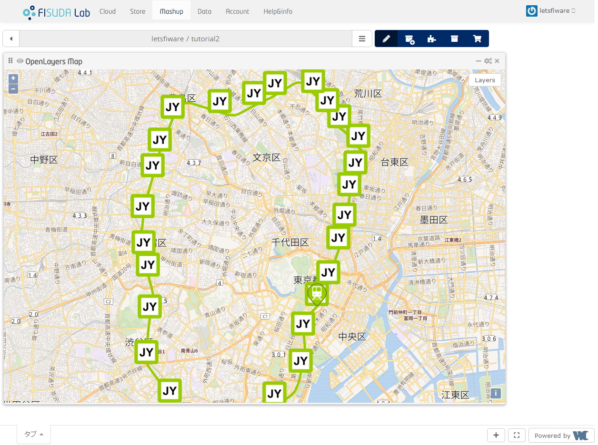

# tutorials.Application-Mashup.draft

## Workspace



## Context Producer

```bash
cd context-producer/
make build
cp config.js.sample config.js
vi config.js
make run
```

### config.js

You should replace the `orion_url` value to your orion url.

```Javascript
var config = {}

config.orion_url='http://orion:1026';
config.fiwareService="tutorial";
config.fiwareServicePath="/train";
config.interval= 10; // second

module.exports = config;
```

## How to build Train datamodel2poi operator

```bash
cd train-datamodel2poi/
npm install
grunt
```

## Wiring

-    NGSI source 4.0.0 : **[Download CoNWeT\_ngsi-source\_4.0.0.wgt](https://github.com/wirecloud-fiware/ngsi-source/releases/download/4.0.0/CoNWeT_ngsi-source_4.0.0.wgt)**
-    FISUDA_train-datamodel2poi_0.1.0.wgt
-    OpenLayers Map 1.1.2 : **[Download CoNWeT\_ol3-map\_1.1.2.wgt](https://github.com/Wirecloud/ol3-map-widget/releases/download/v1.1.2/CoNWeT_ol3-map_1.1.2.wgt)**


## settings


| items | values |
| --- | --- |
| NGSI server URL | your NGSI server URL |
| NGSI proxy URL | your NGSI proxy URL |
| FIWARE-Service | tutorial |
| FIWARE-ServicePath | /train |
| NGSI entity types | Station, Route |


| items | values |
| --- | --- |
| NGSI server URL | your NGSI server URL |
| NGSI proxy URL | your NGSI proxy URL |
| FIWARE-Service | tutorial |
| FIWARE-ServicePath | /train |
| NGSI entity types | Train |
| Monitored NGSI Attributes | location |


| items | values |
| --- | --- |
| Initial location | 139.740376, 35.695539 |
| Initial Zoom Level | 13 |